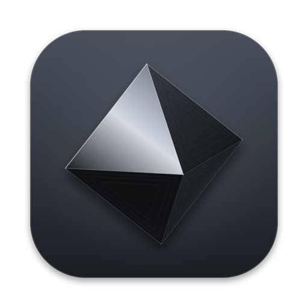
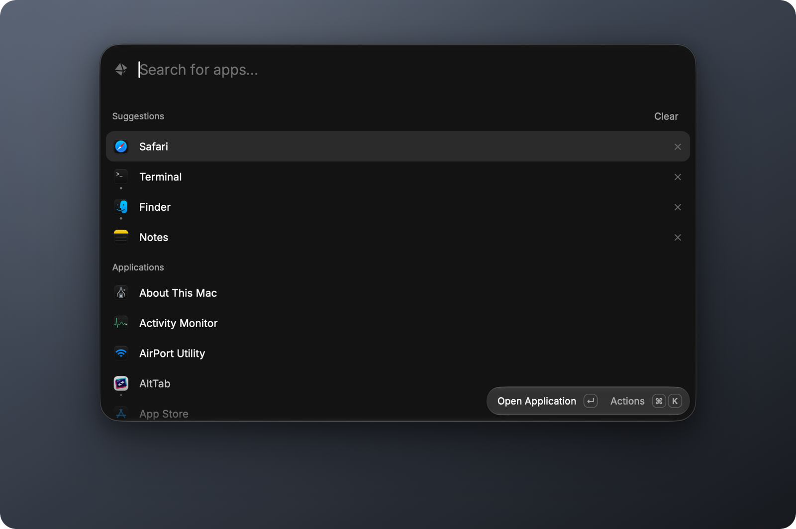
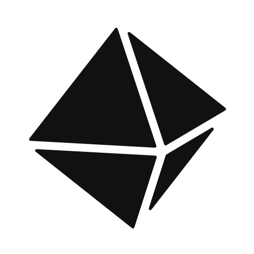

<p align="center">
  
</p>

<h1 align="center">Magnetite</h1>

<p align="center">
  <b>The launcher that only launches apps.</b><br>
  Press ⌘Space, type a few letters, hit ↩. That's the whole app.
</p>

<p align="center">
  
  
  
  
  
</p>

<p align="center">
  
</p>

---

## Why

Raycast is brilliant, but it's a platform: extensions, AI, clipboard history, snippets, window management, a web UI and a background service. If all you do is open apps, you're running all of that to use one box.

Magnetite is that one box, rebuilt natively. It keeps Raycast 2's look (measured from Raycast's own stylesheets: sizes, colors, Inter at weight 350, the glass header and footer pill) and drops everything else. No account, no extensions, no network access, no permissions to grant.

## Performance

Measured side by side on a MacBook Pro (M3 Pro, 18 GB, macOS 27) against Raycast 2.4.1.

| | **Magnetite** | Raycast 2.4.1 |
|---|---:|---:|
| Memory (Activity Monitor footprint, idle) | **23 MB** | 338 MB |
| Idle CPU (60 s sample) | **0.00 %** | 1.4 % |
| Processes / threads | **1 / 4** | 4 / 81 |
| App size | **2.2 MB** ¹ | 208 MB |
| Data it keeps on disk | **< 1 KB** | 193 MB |
| Cold start → window on screen | **0.28 s** | 1.29 s |
| Hotkey → window on screen (median of 30) | ~24 ms | **~18–22 ms** ² |
| Search, per keystroke (112 apps) | **< 1 ms** | – |

¹ 1.2 MB of that is the icon: the metal gradients are dithered to avoid banding, and dithering doesn't compress. The code is 700 KB (one copy for Apple silicon, one for Intel), the trimmed font 340 KB.
² Raycast wins by a few milliseconds here: it reads every key press through an event tap, which needs Accessibility permission. Magnetite uses a plain system hotkey, which needs none. Its own work per open is about 5 ms, most of it macOS moving keyboard focus; the rest is the key's trip through the system and the display's next frame.

<details>
<summary><b>How it stays this light</b></summary>

- **The window never leaves the screen.** Closed, it's invisible and click-through, so opening it is an alpha change plus keyboard focus: no window-server reordering, nothing left to draw. (Measured: hidden, it adds no measurable window-server CPU, even with an animation playing behind it.)
- **Work happens after closing, not before opening.** The list is reset and redrawn right after the window hides.
- **No rescans unless something changed.** The app folders' modification dates are checked first (0.9 ms) instead of re-reading every app bundle (44 ms).
- **Icons are rendered once** at list size, about 10 KB each.
- **The font is trimmed** to the characters and weights the UI uses (880 KB → 340 KB) and loaded straight from its file. Registering it with the system instead would cost 2 MB of per-language tables.
- **Focus before glass.** Keyboard focus is taken before the window becomes visible; Liquid Glass draws unfocused windows as flat "inactive" glass, which would flash for a frame.
- **No App Nap**, so a sleeping background app never delays the hotkey. Idle cost is still zero: there are no timers.

</details>

## Magnetite vs Raycast

| | **Magnetite** | Raycast 2 |
|---|---|---|
| What it does | Finds and opens apps | Launcher + extensions, AI, clipboard, snippets, windows, … |
| Built with | Swift + AppKit, about 860 lines, no dependencies | Native shell, web UI, separate backend process |
| Permissions | None | Accessibility for some features |
| Network | Never connects | Store, sync, AI |
| Account | None | Optional |
| Price | Free, and it's yours | Free core, Pro subscription |

## Features

- **Search that gets you**: exact and prefix matches first, then word starts (`chr` → Google Chrome), initials (`vsc` → Visual Studio Code) and fuzzy (`actmon` → Activity Monitor). Accents don't matter.
- **It learns**: apps you open often rise to the top, fading over about two weeks, and it remembers which app you picked for a query.
- **Suggestions you control**: your most used apps with an empty query; × removes one, Clear wipes them all.
- **Every app, even the hidden ones**: `/Applications`, `/System/Applications`, `~/Applications` (Chrome web apps included) and system folders, including Safari's hidden cryptex symlink.
- **Running apps** get a small dot under their icon.
- **Any shortcut**: press ⌘, then the new combination; it applies instantly.

## Keys

| Key | Does |
|---|---|
| ⌘Space | show / hide |
| ↑ ↓ · ⌃N ⌃P · ⌃J ⌃K | move |
| ↩ | open |
| ⌘↩ | show in Finder |
| ⌘K | actions |
| ⌘, | change the shortcut |
| Esc | clear the search, then close |
| ⌘Q | quit |

## Install

Download **Magnetite-x.y.z.dmg** from the [latest release](https://github.com/JulioFerrero/magnetite/releases/latest), open it and drag Magnetite to Applications. It runs on macOS 14 or later, on Apple silicon and Intel Macs: with Liquid Glass on macOS 26 and later, and a solid background on 14 and 15.

The app isn't notarized (that needs a paid Apple developer account), so the first time you open it macOS says it can't check it. Go to System Settings → Privacy & Security, scroll down and click **Open Anyway**. You only do this once.

Or build it yourself (needs Xcode, for the macOS 26 SDK):

```sh
git clone https://github.com/JulioFerrero/magnetite.git
cd magnetite
./build.sh install   # builds, copies to /Applications, starts it
```

Magnetite adds itself to Login Items on first run; turn that off in System Settings → General → Login Items.

## The name and the stone

Magnetite is lodestone, the naturally magnetic mineral: it pulls things to it, the way this pulls your apps to you. In nature it grows as **octahedra**: opaque, iron-black, with a metallic luster and often faint triangular growth lines on each face. The icon is exactly that, drawn from a real 3D octahedron and lit like polished iron. There's also a one-colour mark:

<p align="center">
  <picture>
    <source media="(prefers-color-scheme: dark)" srcset="assets/logo-white.svg">
    
  </picture>
</p>

## Project

A SwiftPM package with two modules. `MagnetiteCore` is the logic, with no UI: it finds apps, ranks them and turns a query into a `LauncherState`. `Magnetite` is the AppKit app that renders that state. The whole thing is about 860 lines of Swift.

```
Package.swift
Sources/
  MagnetiteCore/                no AppKit
    Catalog.swift               finds apps; skips the rescan when no folder changed
    Matching.swift              prefix, word-start, acronym and fuzzy scoring
    History.swift               frecency, per-query picks, forgetting
    LauncherState.swift         rows, selection and keyboard stepping
    Shortcut.swift              parses and displays key combos
  Magnetite/
    main.swift                  app delegate, login item, menus
    HotKey.swift                global hotkey (Carbon, no permissions)
    Theme.swift                 every size, colour and font
    ShortcutPrompt.swift        "press a new shortcut" dialog
    Launcher/
      LauncherController.swift  show, hide, keys and actions; wires the parts
      LauncherWindow.swift      the panel, its card and shadow
      SearchBar.swift           field, placeholder and mark on one baseline
      ResultsList.swift         rows, selection, edge fades, icon cache
      Footer.swift              the Open / Actions pill
    UI/
      Views.swift               layout helpers, fills, glass or solid surfaces
      Buttons.swift             hover, footer and symbol buttons
scripts/                        icon, one-colour logo, font and DMG builders
```

`swift build` compiles it; `./build.sh` wraps it into `Magnetite.app`. Every size and colour lives in `Sources/Magnetite/Theme.swift`.

## Credits

- UI modelled on [Raycast](https://raycast.com) 2's root search. Magnetite isn't affiliated with Raycast.
- [Inter](https://rsms.me/inter/) by Rasmus Andersson, SIL Open Font License (`Resources/Fonts/LICENSE.txt`).
